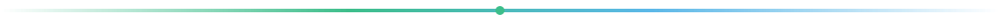

<!-- https://github.com/mad0021 -->

<div align="center">

  

  <br /><br />

  

  <br />

  

  <p>
    <a href="https://www.linkedin.com/in/madev021/"></a>
    <a href="mailto:mamadoudiallo2002@gmail.com"></a>
    <a href="https://github.com/mad0021?tab=repositories"></a>
  </p>

</div>

---

### The vibe

```text
Spreadsheets everywhere.
Approvals stuck in email.
Reports nobody trusts.
        ↓
   Power Platform + data
        ↓
Tools people actually open on Monday morning.
```

<div align="center">
  
</div>

---

### Stack

<div align="center">
  
</div>

<br />

<p align="center">
  
  
  
  
  
</p>

---

### Now shipping

| Mode | What |
|:-----|:-----|
| **Day job** | Plataforma Educativa — apps, flows, BI, ADF, Dataverse, SQL |
| **Side product** | [etable](https://github.com/mad0021/etable) — restaurant system on Android tablets |
| **Web** | [porfolio](https://github.com/mad0021/porfolio) — React + TypeScript + Vite |

---

### Pulse

<div align="center">
  
  
</div>

<br />

<div align="center">
  
</div>

<div align="center">
  <picture>
    <source media="(prefers-color-scheme: dark)" srcset="https://raw.githubusercontent.com/mad0021/mad0021/output/github-snake-dark.svg" />
    <source media="(prefers-color-scheme: light)" srcset="https://raw.githubusercontent.com/mad0021/mad0021/output/github-snake.svg" />
    
  </picture>
</div>

---

<div align="center">

### Let’s talk

<a href="https://www.linkedin.com/in/madev021/"><b>LinkedIn</b></a> ·
<a href="mailto:mamadoudiallo2002@gmail.com"><b>Email</b></a> ·
<a href="https://github.com/mad0021/etable"><b>eTable</b></a>


<sub>CA/ES native · English C1 · DAM · Girona</sub>

</div>
