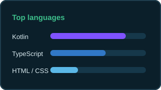

<!--
  Profile README — mad0021
  Visible en: https://github.com/mad0021
-->

<div align="center">
  
</div>

<br />

<div align="center">

[](https://www.linkedin.com/in/madev021)
[](mailto:mamadoudiallo2002@gmail.com)
[](https://github.com/mad0021)
[](https://www.google.com/maps/place/Girona)

</div>

---

### Quién soy

Construyo software donde **negocio, datos y automatización** se encuentran.

En **Plataforma Educativa** (Girona) trabajo el ciclo completo del ecosistema Microsoft: apps en **Power Apps**, procesos con **Power Automate**, pipelines con **Azure Data Factory** y reporting en **Power BI**, apoyado en **Dataverse / SQL**.

También desarrollo producto en **Android (Kotlin + Jetpack Compose)** y **web (TypeScript / React)**.

<div align="center">
  
</div>

---

### Cómo trabajo

| Enfoque | Qué entrego |
|:--------|:------------|
| **Apps** | Interfaces en Power Apps orientadas a procesos reales del día a día |
| **Automatización** | Flujos en Power Automate que quitan trabajo manual y errores |
| **Datos** | ADF + SQL / warehouse para tener datos fiables y listos |
| **Insight** | Power BI para decidir con indicadores claros |
| **Producto** | Apps Android y web cuando el caso lo pide |

---

### Stack

<p align="center">
  
  
  
  
  
  
  
  
  <br />
  
  
  
  
  
  
</p>

---

### Destacados

<table>
  <tr>
    <td width="50%" valign="top">
      <h3><a href="https://github.com/mad0021/etable">etable</a></h3>
      <p>Sistema de gestión para restaurantes en <b>tablets Android</b>.</p>
      <p><code>Kotlin</code> · <code>Jetpack Compose</code> · <code>Firebase</code> · offline-first</p>
      <a href="https://github.com/mad0021/etable"></a>
      <a href="https://github.com/mad0021/etable"></a>
    </td>
    <td width="50%" valign="top">
      <h3><a href="https://github.com/mad0021/porfolio">porfolio</a></h3>
      <p>Base de portfolio web orientado a reclutadores y producto.</p>
      <p><code>React</code> · <code>TypeScript</code> · <code>Vite</code></p>
      <a href="https://github.com/mad0021/porfolio"></a>
      <a href="https://github.com/mad0021/porfolio"></a>
    </td>
  </tr>
</table>

---

### Formación & idiomas

<details open>
<summary><b>Formación</b></summary>
<br />

- **FP GS — Desarrollo de Aplicaciones Multiplataforma (DAM)** · Institut Pla de l’Estany (Banyoles)
- **Fundamentos de Ciberseguridad** · edX (42 h)
- Bachillerato · Institut Santiago Sobrequés i Vidal (Girona)

</details>

<details open>
<summary><b>Idiomas</b></summary>
<br />

| Idioma | Nivel |
|:-------|:------|
| Català | Natiu |
| Castellano | Natiu |
| English | C1 (EOI) |
| Français | A1 (EOI) |

</details>

---

### Ahora mismo

```text
Plataforma Educativa  →  Power Apps · Automate · BI · Data Factory · Dataverse
Open to collaborate   →  Power Platform, datos y producto con impacto real
```

<div align="center">




<br /><br />

<strong>¿Hablamos?</strong>  
<a href="https://www.linkedin.com/in/madev021">LinkedIn</a> · <a href="mailto:mamadoudiallo2002@gmail.com">mamadoudiallo2002@gmail.com</a> · <a href="https://github.com/mad0021">GitHub</a>

</div>
