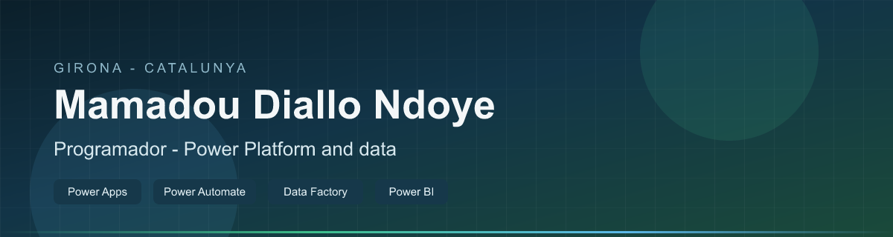
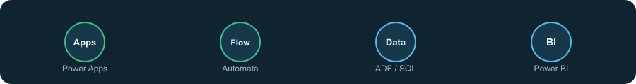
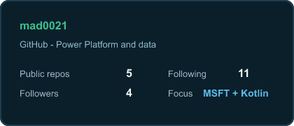
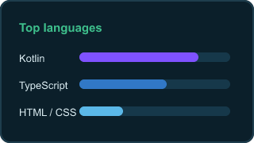

<!-- https://github.com/mad0021 -->

  

  <h1>Mamadou Diallo Ndoye</h1>
  
<b>I build Microsoft tools people actually use.</b>

  
Power Apps · Automate · Power BI · Data Factory · Girona

  

    
    
    
  

---

### The problem I like solving

Spreadsheets everywhere.  
Approvals stuck in email.  
Reports nobody trusts.

I turn that into **working apps, flows, and data** — on the Microsoft stack.

  

---

### What I ship

| | |
|:--|:--|
| **Now** | Plataforma Educativa — Power Apps, Automate, BI, ADF, Dataverse, SQL |
| **Also** | Android (Kotlin/Compose) + web (TypeScript/React) when low-code isn’t enough |
| **Proof** | [etable](https://github.com/mad0021/etable) — restaurant system for tablets |

---

### Stack

  
  
  
  
  
  
  
  
  

---

  

### Let’s talk

<a href="https://www.linkedin.com/in/madev021/"><b>LinkedIn</b></a> ·
<a href="mailto:mamadoudiallo2002@gmail.com"><b>Email</b></a> ·
<a href="https://github.com/mad0021/etable"><b>eTable</b></a>

