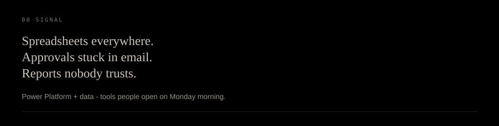
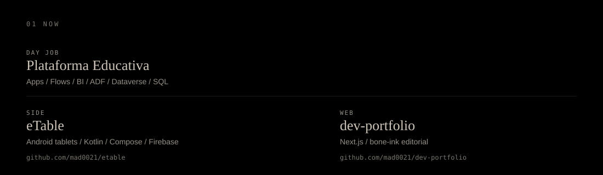

<!-- Pure Ryoku dossier — black SVG panels (BOM-free) -->

<a href="https://github.com/mad0021/dev-portfolio">Portfolio</a>
·
<a href="https://github.com/mad0021/etable">eTable</a>
·
<a href="https://www.linkedin.com/in/madev021/">LinkedIn</a>
·
<a href="mailto:mamadoudiallo2002@gmail.com">Email</a>

