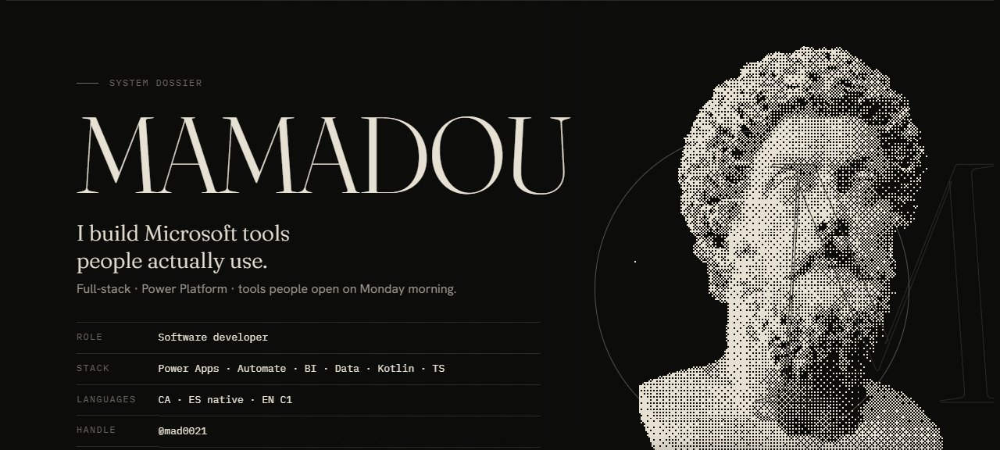

### Software developer, Power Platform & data

I build Microsoft tools people actually use: apps that replace the shared spreadsheet, flows that
stop depending on someone remembering, pipelines that move data cleanly, and reports people
trust. On the side I build product in Kotlin.

| | What | Tools |
|---|---|---|
| **Apps** | Forms, records and screens for day-to-day work | Power Apps (canvas, model-driven), Dataverse |
| **Flow** | Approvals, alerts and hand-offs on autopilot | Power Automate (cloud flows, approvals) |
| **Data** | Pipelines between systems, clean and on time | Azure Data Factory, SQL |
| **BI** | One clear answer instead of another table | Power BI, DAX, semantic models |

### Featured

<table>
<tr>
<td width="50%" valign="top">

**[mad0021.github.io](https://github.com/mad0021/mad0021.github.io)** 
Portfolio as a "system dossier": live dithered illustrations, 31 themes, rendering in a
Web Worker with `OffscreenCanvas`. Vanilla JS, no build step. 
HTML · CSS · JavaScript · Web Workers

</td>
<td width="50%" valign="top">

**[eTable](https://github.com/mad0021/etable)** 
Restaurant management for Android tablets, built offline-first. Admin and waiter roles, real-time
sync, and the floor keeps working when the wifi drops. 
Kotlin · Jetpack Compose · Firebase · Material 3

</td>
</tr>
</table>

### Stack

`Power Apps` `Power Automate` `Power BI` `Dataverse` `Data Factory` `SQL` `Azure` `Kotlin` `TypeScript` `React`

Languages: Catalan and Spanish (native), English (C1).

### Contact

[Portfolio](https://mad0021.github.io/?lang=en) · [LinkedIn](https://www.linkedin.com/in/madev021/) · [Email](mailto:mamadoudiallo2002@gmail.com)

The header is a live capture of the portfolio. The bust is a CC0 photo of Marcus Aurelius, dithered in the browser.
