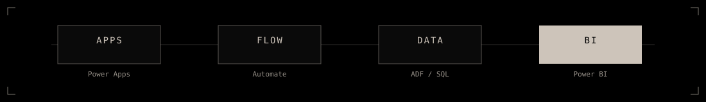
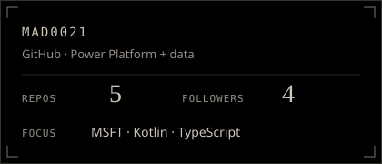
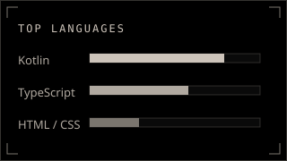

<!-- https://github.com/mad0021 — Ryoku-style dossier. No badges / typing / snake. -->

<div align="center">
  
</div>

<br/>

```text
— 作 · SYSTEM DOSSIER ♦

@ mad0021 · Software Developer
LOCAL · Girona, Catalunya

ROLE ........ Software Developer
BASE ........ Girona, Catalunya
FOCUS ....... Power Platform
STACK ....... TS · Kotlin · Azure
LANG ........ CA · ES · EN

INK RAMP · bone on black
```

```text
I build Microsoft tools people actually use.
Full-stack · Power Platform · tools that open on Monday morning.
```

<div align="center">
  
</div>

### 00 // Signal

```text
Spreadsheets everywhere.
Approvals stuck in email.
Reports nobody trusts.
              ↓
      Power Platform + data
              ↓
Tools people open on Monday morning.
```

<div align="center">
  
</div>

### 01 // Now

```text
DAY JOB ........ Plataforma Educativa
                 Apps · Flows · BI · ADF · Dataverse · SQL

SIDE ........... eTable
                 Android tablets · Kotlin · Compose · Firebase
                 → github.com/mad0021/etable

WEB ............ dev-portfolio
                 Next.js · bone/ink editorial
                 → github.com/mad0021/dev-portfolio
```

### 02 // Stack

```text
01  Power Apps
02  Power Automate
03  Power BI
04  Data Factory
05  Dataverse
06  SQL
07  Kotlin
08  TypeScript
09  React
10  Azure
```

### 03 // Vitals

```text
2  NOW .............. active tracks
2  PROJECTS ......... public builds
10 STACK ............ tools in rotation
1  SOURCE ........... this profile
```

<div align="center">
  
  &nbsp;
  
</div>

### 04 // Contact

```text
PORTFOLIO ...... github.com/mad0021/dev-portfolio
LINKEDIN ....... linkedin.com/in/madev021
EMAIL .......... mamadoudiallo2002@gmail.com
GITHUB ......... github.com/mad0021
```

<div align="center">
  
  <br/>
  <sub>作 · CA/ES native · English C1 · DAM · Girona</sub>
</div>
